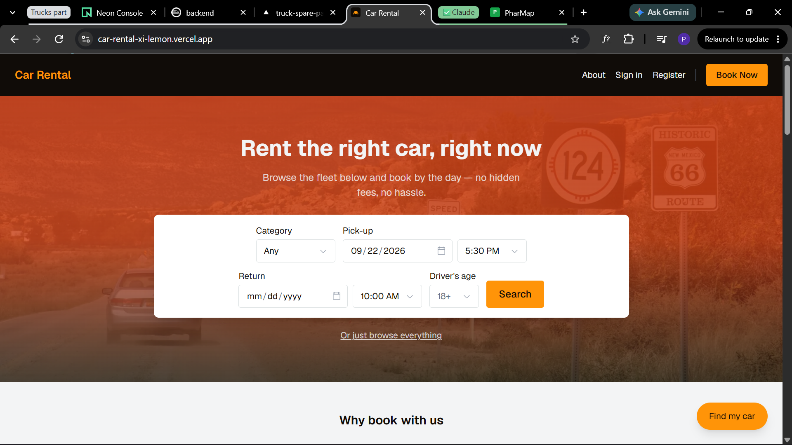
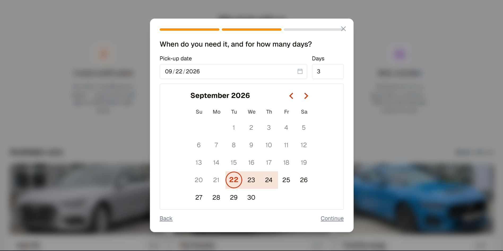
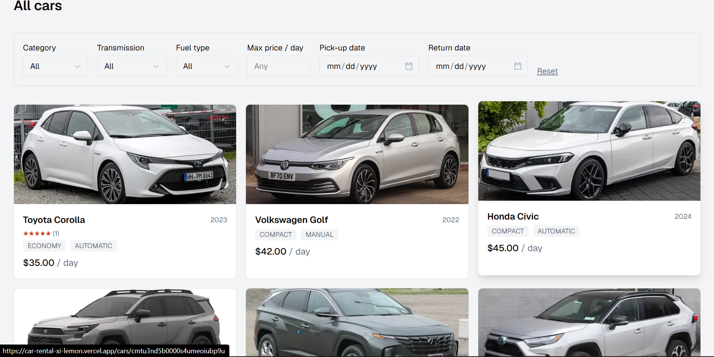
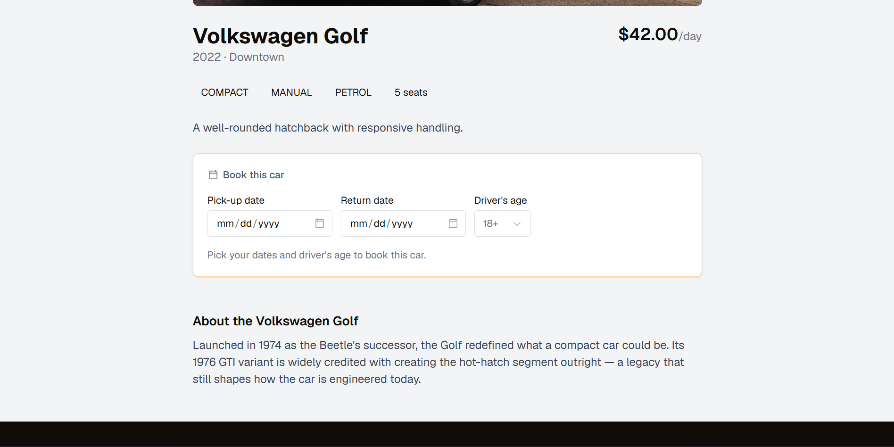
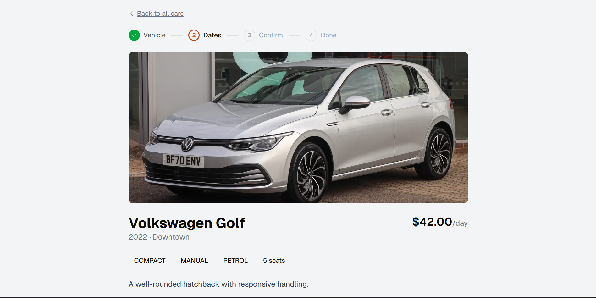
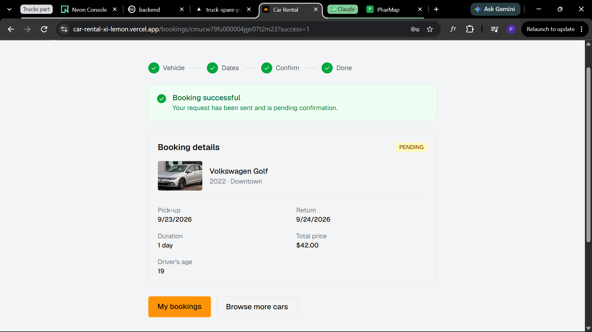
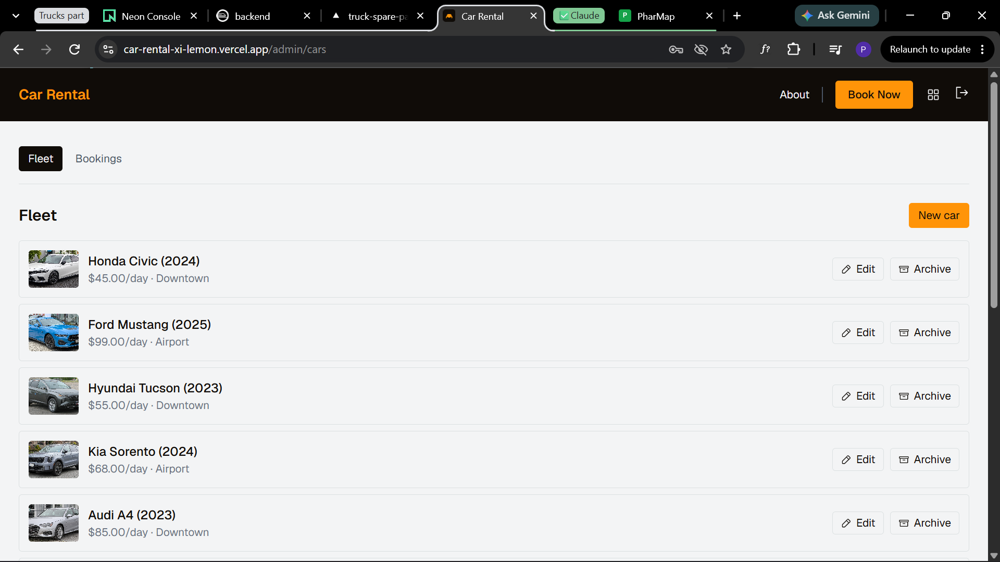
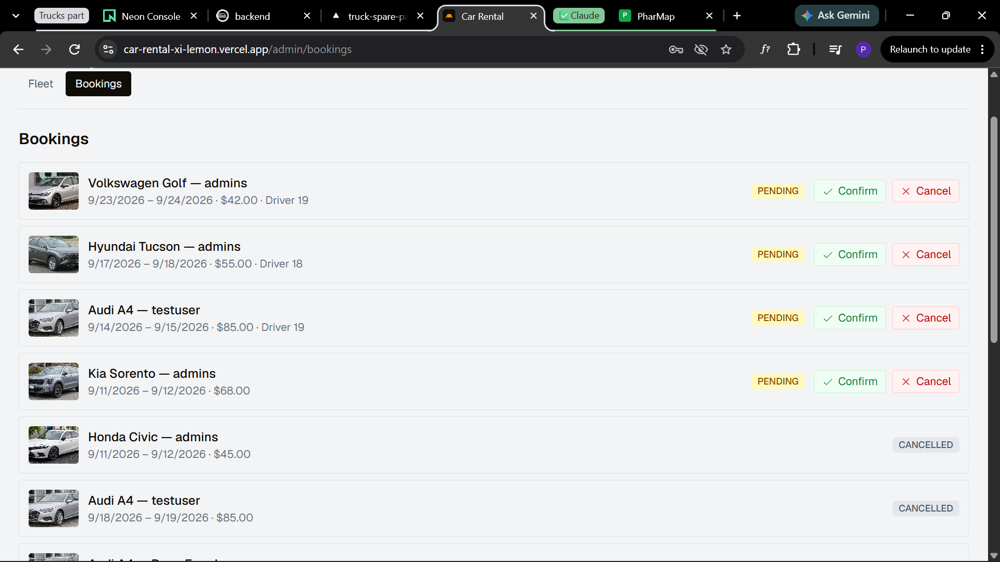

# Car Rental

A full-stack car rental booking platform — search a fleet by dates and category,
book by the day, and manage cars and bookings from an admin panel. Built with
Next.js, TypeScript, Prisma and PostgreSQL.

**Live demo:** https://car-rental-xi-lemon.vercel.app
(a working portfolio demo, not a live commercial rental business — see
[Live demo](#live-demo) below)

## Overview

A car rental business needs customers to search a fleet by availability and
category, book with pricing that can't quietly change after the fact, and have
a basic policy (a minimum driver age) enforced consistently everywhere it
applies — while staff need an admin view to manage the fleet and bookings.
This project builds that end to end: a public booking flow and an admin panel,
backed by a real relational schema for cars, bookings and reviews.

## Features

- Search and browse the fleet by category, transmission and fuel type, with a
  dedicated find-my-car wizard
- Book by the day with a date-range picker; the total price is computed once
  at booking time and stored, so a later change to a car's daily rate never
  retroactively changes an existing booking
- Minimum driver age (18+) enforced and carried through consistently: search,
  booking form, and the admin booking view
- Authentication via Auth.js (NextAuth v5): Google OAuth and email/password
  (bcrypt-hashed) in one system, JWT sessions
- Password reset flow (token-based, reusing Auth.js's own verification-token
  table) — see [Technical decisions](#technical-decisions) for how it's
  simplified in this demo
- Reviews tied one-to-one to a completed booking
- Admin panel for cars and bookings; a car with existing bookings can't be
  hard-deleted — it's archived instead, preserving booking history
- A real confirmation screen after a successful booking
- Responsive booking forms and admin views, including fixes for date/time
  field overflow on mobile and iOS Safari specifically
- Open Graph and Twitter card metadata so a shared link renders a proper
  preview
- An honest cookie-consent notice — no cookie-preference banner that doesn't
  actually do anything

## Screenshots

### Homepage


### Find-my-car search wizard


### Fleet listing with filters


### Car detail page


### Booking form


### Booking confirmation


### Admin — car management


### Admin — booking management


## Tech stack

| Layer | Choice | Why |
|---|---|---|
| Frontend | Next.js 16 (App Router) + TypeScript + Tailwind v4 | Server components for data-heavy pages (listings, bookings), client components only where interaction demands it |
| Database | PostgreSQL (hosted on Supabase) + Prisma 7 | Relational integrity for cars, bookings and reviews; a typed client over hand-written SQL |
| Auth | Auth.js (NextAuth v5) + `@auth/prisma-adapter` | One system for Google OAuth and email/password, with the adapter persisting users/accounts/sessions to Postgres |
| Animation | Motion | Used on the interactive booking flow, not as decoration on every element |
| Hosting | Vercel | Matches the Next.js deployment model with zero server management |

## Architecture

- **App Router pages** (`src/app`) — public routes (home, `/cars`, `/cars/[id]`,
  `/bookings`, `/bookings/[id]`, `/about`) and an admin section
  (`/admin/cars`, `/admin/bookings`) gated by the authenticated user's role.
- **Auth** (`src/auth.ts`) — Google OAuth and credentials in one Auth.js
  config. Credentials sign-in can't use database sessions (the adapter has no
  way to persist a session for a provider it doesn't manage), so the whole app
  runs on encrypted JWT sessions; Google sign-in still gets its `User`/
  `Account` rows created by the Prisma adapter on first login.
- **Server actions** (`src/lib/actions`) — mutations (`booking.ts`,
  `review.ts`, `admin.ts`, `auth.ts`, `passwordReset.ts`) run as Next.js
  Server Actions rather than a separate API layer, since every mutation here
  originates from a form in this same app.
- **Database** (`prisma/schema.prisma`) — `User`/`Account`/`Session`/
  `VerificationToken` (the shape Auth.js's Prisma adapter requires), plus the
  domain models: `Car`, `Booking`, `Review`. Money is stored as `Decimal`, not
  `Float`, because floating-point can't represent prices exactly. A car with
  existing bookings can't be deleted (`onDelete: Restrict`) — it's archived
  via `Car.isActive` instead.

## Technical decisions

- **Booking price integrity.** `Booking.totalPrice` is computed from
  `car.pricePerDay × days` once, at booking time, and stored — not
  recalculated later. If a car's daily rate changes next month, existing
  bookings don't retroactively change.
- **Password reset without an email provider.** No email vendor is wired up
  in this demo, so the reset flow shows the reset link directly in the UI
  instead of emailing it. The account-enumeration protection (always showing
  the same "check your inbox"-style response) is still implemented as if
  email delivery were real, since that's the actual security property worth
  getting right — bolting on a transactional email provider later wouldn't
  change that logic.
- **`trustHost: true` in Auth.js.** Auth.js only trusts the request's `Host`
  header automatically on Vercel/Cloudflare Pages, which set that
  environment themselves. Any other production host needs this set
  explicitly, or every `auth()` call logs an `UntrustedHost` error. This is a
  real trust boundary, not a default to flip blindly — safe only because
  whatever sits in front of this app sets `Host` from the actual request
  rather than passing through unchecked client input.
- **Generating the Prisma client on `postinstall`.** Vercel builds were
  failing without it, since the generated client wasn't guaranteed to exist
  before the build step ran.

## Installation

```bash
git clone https://github.com/Naviolance/car-rental.git
cd car-rental
npm install
cp .env.example .env   # fill in the values — see below
npx prisma migrate deploy
npm run dev
```

## Environment variables

```env
DATABASE_URL=
DIRECT_URL=
AUTH_SECRET=
AUTH_GOOGLE_ID=
AUTH_GOOGLE_SECRET=
SUPABASE_URL=
SUPABASE_SECRET_KEY=
```

- `DATABASE_URL` / `DIRECT_URL` — Postgres connection strings (pooled and
  direct) for Prisma. This project is set up against a Supabase Postgres
  instance.
- `AUTH_SECRET` — Auth.js session encryption secret (`npx auth secret` to
  generate one).
- `AUTH_GOOGLE_ID` / `AUTH_GOOGLE_SECRET` — Google OAuth client credentials.
- `SUPABASE_URL` / `SUPABASE_SECRET_KEY` — Supabase project credentials.

Never commit `.env` — it's git-ignored in this repo.

## Running locally

```bash
npm run dev      # http://localhost:3000
npm run build    # production build (also type-checks)
npm run lint      # eslint
```

Prisma:

```bash
npx prisma migrate dev     # apply/create migrations locally
npx prisma studio          # database GUI
```

## Deployment

Deployed on Vercel, connected to the `main`/`master` branch of this
repository. The Prisma client is generated automatically on install
(`postinstall` script) so Vercel builds don't need a manual step. Environment
variables above are configured in the Vercel project settings, not committed
to the repo.

## Live demo

https://car-rental-xi-lemon.vercel.app

This is a working demo backed by a live Postgres database — the full booking
lifecycle (search, book, confirm, admin management) runs end to end. It is
explicitly presented in the app's own metadata as a portfolio project, not a
real rental business.

## Future improvements

- Wire up a real transactional email provider for password reset and booking
  confirmations, instead of displaying the reset link directly
- Payment integration at checkout (currently a booking is confirmed without a
  payment step)
- Booking cancellation/refund flow from the customer side

## Author

**Forsangam Weyegho Junior Priestly** — Full-Stack Software Engineer
[Portfolio](https://jpfw-webservices.vercel.app/en) ·
[Case study](https://jpfw-webservices.vercel.app/en/projects/car-rental) ·
[LinkedIn](https://www.linkedin.com/in/forsangam-weyegho-junior-priestly-965897236) ·
[GitHub](https://github.com/Naviolance) ·
forsangamjunior@gmail.com

## License

© 2026 Forsangam Weyegho Junior Priestly (JPFW Web Services). All rights reserved.

This code is public so clients and employers can review my work. It is **not open source**: you may not copy, deploy, modify or sell it without my written permission. See [LICENSE](LICENSE).
